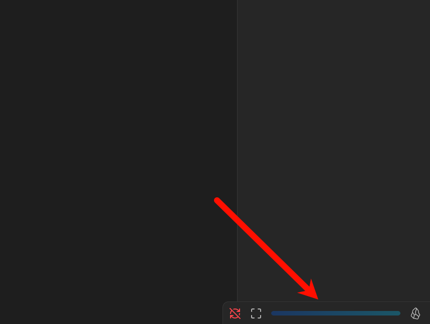
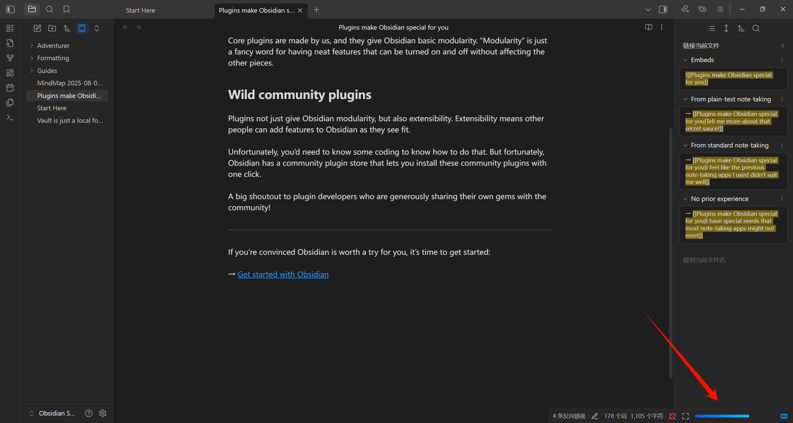
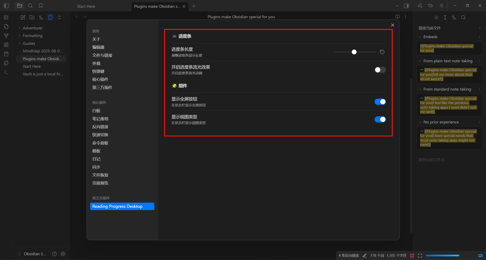

### 中文 | [English](./README.md)

# obsidian-reading-progress-desktop 插件

**此插件只适用于桌面端，请勿将其使用在移动端**。

开启插件后，将在状态栏生成三个组件：全屏按钮、进度条、视图类型标志。

## 安装方法

1. 下载 Release 中的最新版本，包括三个文件 `main.js`、`manifest.json`、`styles.css`,
2. 在 Obsidian 中打开 **设置** => **第三方插件** => **已安装插件** ，右边的文件夹图标中可以直接打开插件的文件夹，
3. 在插件的文件夹下面新建一个文件夹，命名为：`reading-progress-desktop`，并将第一步的三个文件复制进去，然后在第二步同样的地方找到刷新按钮，点击刷新后即可看到对应的插件，名字为：`Reading Progress Desktop`。

## 使用方法

打开插件后，可以看到状态栏生成了三个组件：从左到右分别是**全屏按钮**、**进度条**、**视图类型标志**，其中全屏按钮和视图类型标志可在设置中关闭：

目前支持的视图类型有：markdown、pdf、search、thino、bases，当浏览其他视图的时候进度条颜色会变成灰色，即不生效状态。

此插件提供了几个设置的选项：可以调整进度条的长度、进度条动画、以及关闭其余的两个组件。

## 多语言

此插件目前适配了中文和英文，如果有想适配的语言，欢迎在 issue 提出（大概也不会有吧）。

## 视图

因为本人常用的视图类型都适配了，可能有些第三方的插件会有自己的视图，如果有需要，也欢迎在 issue 中提出，前提是视图不可以无限滚动（类型canvas，这种视图是可以无限滚动的，无法统计进度）。

## 结语

如果想自己修改的话，可以直接 clone 本仓库，然后在对应的目录下修改自己的代码，然后运行 `npm run build`，将生成的 `main.js` 覆盖到对应插件的目录下即可。
