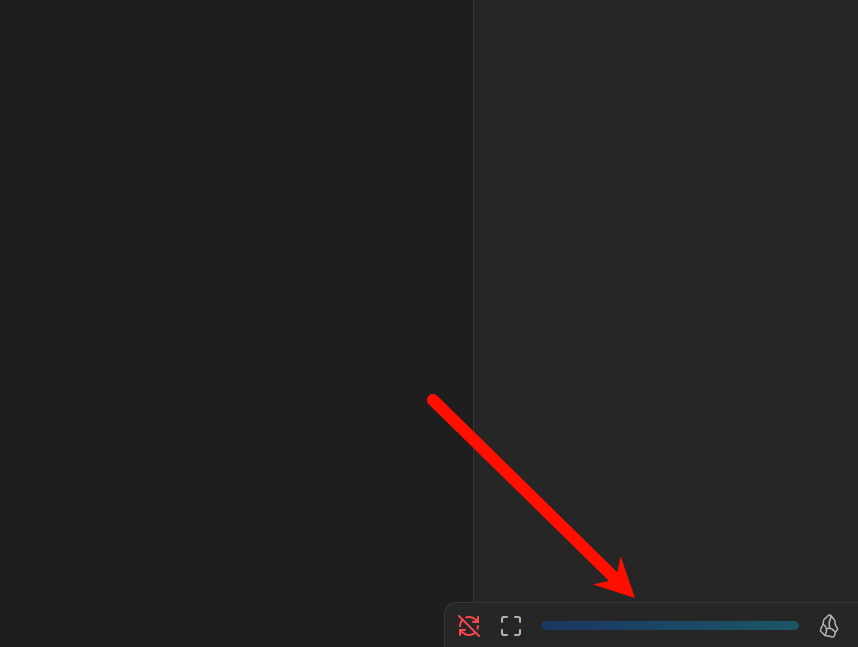
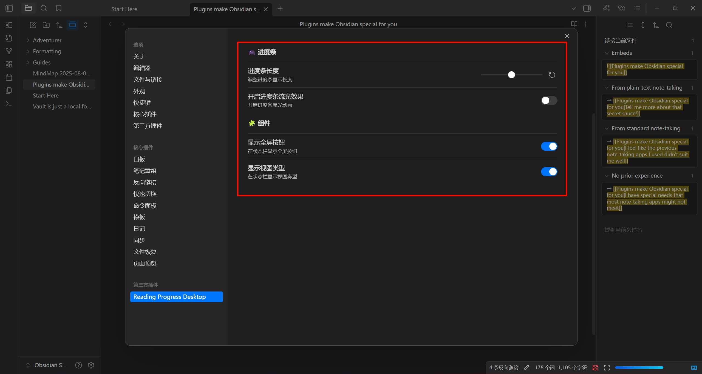

### English | [中文](./README-zh_cn.md)

## Reading Progress Desktop Plugin

**This plugin is designed for desktop use only. Please do not use it on mobile devices.**

Once enabled, the plugin will generate three components in the status bar: a full-screen button, a progress bar, and a view type indicator.

## Installation

1. Download the latest version from the Release, which includes three files: `main.js`, `manifest.json`, and `styles.css`.
2. In Obsidian, go to **Settings** => **Community plugins** => **Installed plugins**. Click the folder icon on the right to open the plugins folder.
3. Create a new folder named `reading-progress-desktop` inside the plugins folder. Copy the three files from step one into this folder. Then, click the refresh button in the same section as step two. You should now see the plugin listed as `Reading progress desktop`.

## Usage

After enabling the plugin, you will see three components in the status bar from left to right: **Full-screen button**, **Progress bar**, and **View type indicator**. The full-screen button and view type indicator can be disabled in the settings:

Currently supported view types include: markdown, pdf, search, thino, and bases. When browsing other view types, the progress bar will turn gray, indicating it is inactive.

The plugin offers several configuration options: you can adjust the length of the progress bar, enable/disable progress bar animations, and toggle the other two components.

## Multi-language Support

The plugin currently supports both Chinese and English. If you would like to add support for another language, feel free to submit a request via the issues section (though it might be unlikely).

## View Types

Since I have adapted the plugin for the view types I commonly use, some third-party plugins may have their own view types. If you need support for additional view types, please submit a request via the issues section. Note that views with infinite scrolling (such as canvas) are not supported, as it is impossible to track progress in such cases.

## Conclusion

If you wish to make modifications, you can clone this repository, make changes in the corresponding directory, and then run `npm run build`. Replace the `main.js` file in the plugin directory with the newly generated one.